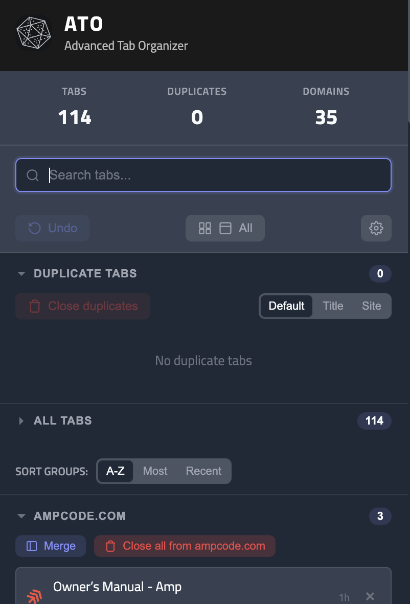

# ATO - Advanced Tab Organizer

Kill duplicate tabs instantly. Stay focused.

<p align="center">
  
</p>

## What It Does

- **Badge Counter** - Shows how many duplicate tabs you have
- **One-Click Cleanup** - Close all duplicates with one button
- **Playing Media** - Tabs producing sound are grouped in a section on top, and flagged with a speaker icon wherever they're listed
- **Search** - Filter open tabs by title or URL with keyboard navigation
- **Domain Groups** - Tabs grouped by site, sortable A-Z / Most / Recent
- **Merge & Close per Domain** - Consolidate or clear all tabs from a site
- **Undo** - Restore tabs you just closed
- **Keyboard Shortcut** - `Cmd+U` (Mac) or `Ctrl+U` (Windows/Linux)
- **Real-Time Updates** - Badge updates automatically as you browse

## Screenshots

<p align="center">
  
</p>

Stats header (tabs / duplicates / domains), search bar, view toggle, duplicates section with sort options, and domain-grouped tab list with per-domain Merge and Close actions.

## Installation

### 1. Clone and Build

```bash
git clone https://github.com/jeanlucaslima/ato.git
cd ato
npm install
npm run icons
npm run build
```

### 2. Load in Chrome

1. Open `chrome://extensions`
2. Enable **Developer mode** (toggle in top right)
3. Click **Load unpacked**
4. Select the `dist/` folder

### 3. Use It

- Press `Cmd+U` / `Ctrl+U` to open the popup
- Or click the ATO icon in your toolbar
- Click **Close duplicates** to remove all duplicate tabs

## Development

```bash
# Watch mode (auto-rebuild on changes)
npm run dev

# Run tests
npm test

# Build for production
npm run build
```

After changes, click the refresh icon on `chrome://extensions` to reload.

## Project Structure

```
src/
├── manifest.json           # Extension configuration
├── background/
│   └── service-worker.js   # Tab monitoring, badge updates
├── popup/
│   ├── popup.html          # Popup UI
│   ├── popup.css           # Styles
│   └── popup.js            # Popup logic
├── shared/
│   ├── tab-utils.js        # Shared utility functions
│   └── tab-utils.test.js   # Tests
└── assets/icons/           # Extension icons
```

## License

MIT
